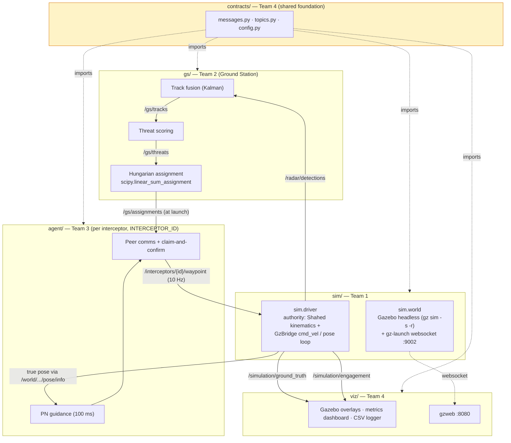
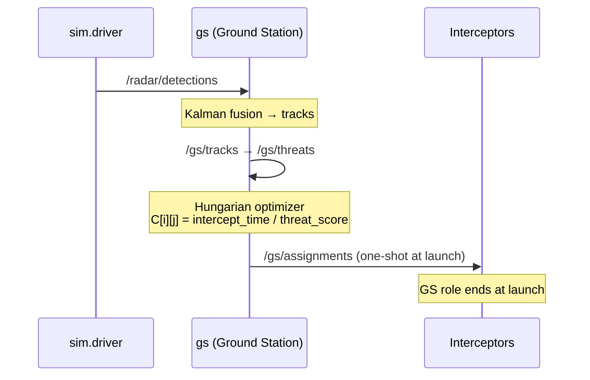
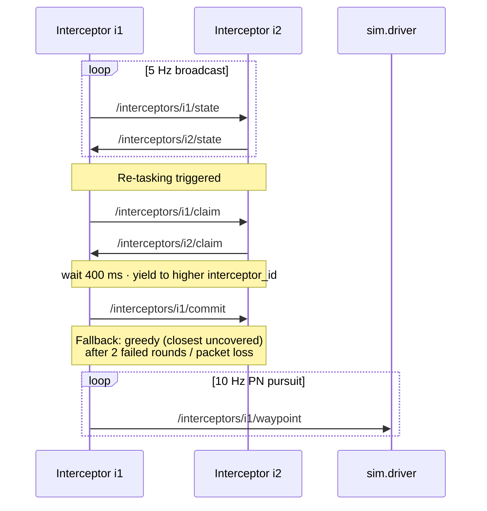
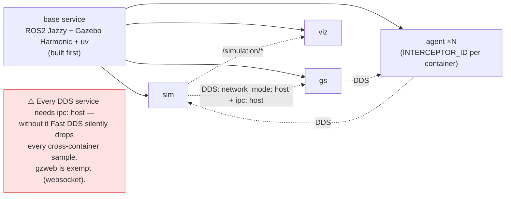

# System Architecture

Real-Time Multi-Interceptor Coordination — EDTH Paris.

The system compares two scenarios: **Situation A** (interceptors fly fixed pre-launch
assignments, no comms) vs **Situation B** (interceptors share state mid-flight and
re-assign via claim-and-confirm consensus). All inter-process communication is ROS2
pub/sub; topic names come from `contracts/contracts/topics.py`.

## Component & Data-Flow Overview

## Pre-launch Flow (Situation A & B — Ground Station active)

## In-flight Re-tasking (Situation B only — peer-to-peer consensus)

## Deployment (Docker Compose)

> **ID bridge:** agent id `i{n}` ↔ gz model `interceptor_{n}`; track id `t{n}` ↔ gz model `shahed_{n}`.
