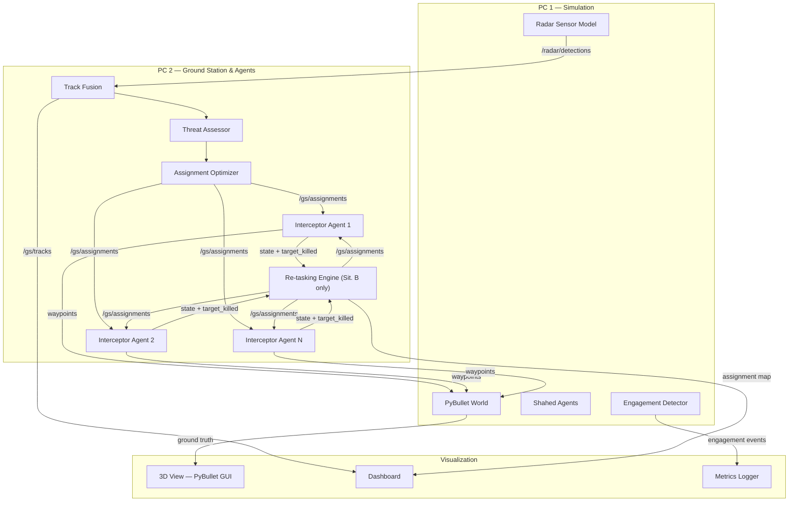
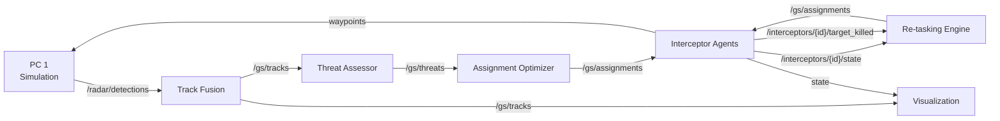
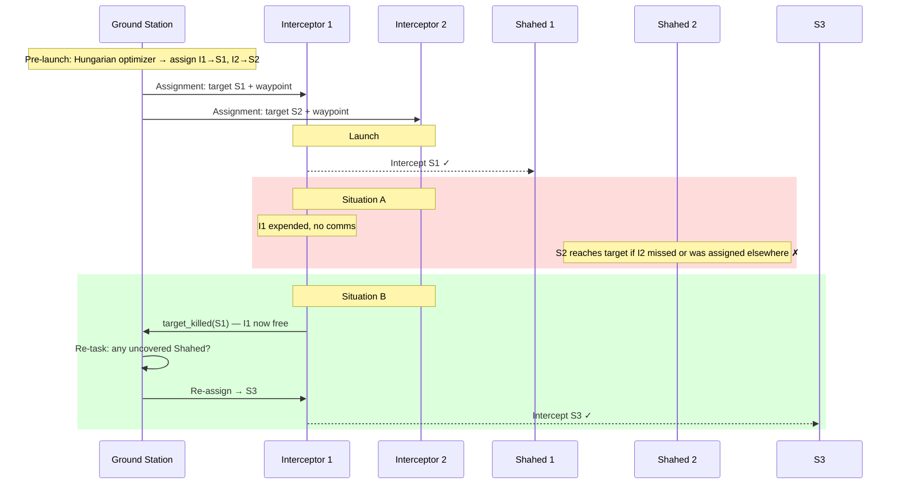
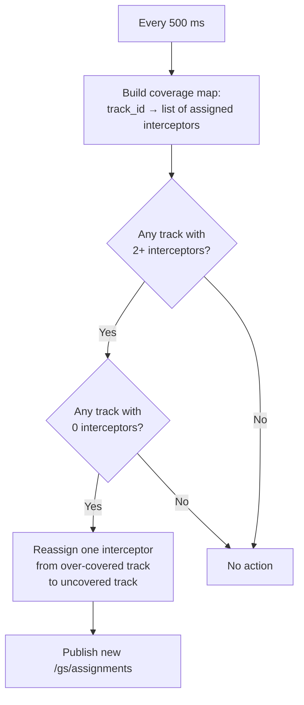

# Architecture Design
## Real-Time Multi-Interceptor Coordination

---

## 1. Component Map



---

## 2. ROS2 Topic / Data Flow



| Topic | Publisher | Subscribers |
|---|---|---|
| `/radar/detections` | Radar Sensor Model | Track Fusion |
| `/gs/tracks` | Track Fusion | Threat Assessor, Visualization |
| `/gs/threats` | Threat Assessor | Assignment Optimizer |
| `/gs/assignments` | Optimizer / Re-tasking Engine | Interceptor Agents |
| `/interceptors/{id}/state` | Interceptor Agent | Re-tasking Engine, Visualization, Peers (Sit. B) |
| `/interceptors/{id}/target_killed` | Interceptor Agent | Re-tasking Engine |

In **Situation A**, agents do not subscribe to `/interceptors/+/state` or publish `target_killed`. The Re-tasking Engine node is not started.

---

## 3. Situation A vs B — Operational Flow



---

## 4. Convergence Detection (Situation B)

The re-tasking engine runs a **coverage audit** every cycle:



This detects both failure modes:
- **Dead target redundancy:** track disappears from simulation → interceptors assigned to it become free → triggers reassignment.
- **Convergence on proximate targets:** both I1 and I2 report the same `target_id` → coverage map shows 2 on one track, 0 on another → reassign.

---

## 5. Module Breakdown

### `sim/` — Simulation Engine (PC 1)
```
sim/
├── world.py              # PyBullet init, step loop
├── shahed_agent.py       # Shahed: fly toward target, configurable speed/heading
├── interceptor_body.py   # PyBullet body, receives waypoints, applies forces
├── radar_sensor.py       # Gaussian noise, FOV/range filter, publishes /radar/detections
├── engagement.py         # Proximity check → engagement event, removes bodies
└── config_loader.py      # Loads and validates scenario YAML
```

### `gs/` — Ground Station (PC 2)
```
gs/
├── track_fusion.py           # Kalman filter bank, one filter per track ID
├── track_manager.py          # Track birth/death (gating, coasting, dropout)
├── threat_assessor.py        # Score = w1/distance + w2*speed + w3/ETA
├── assignment_optimizer.py   # scipy.optimize.linear_sum_assignment (Hungarian)
└── retasking_engine.py       # Coverage audit + reassignment (Sit. B)
```

### `agent/` — Interceptor Agent (PC 2 or Pi)
```
agent/
├── interceptor_agent.py  # Main loop: receive assignment, run guidance, publish state
├── guidance.py           # Proportional navigation, 100 ms update
├── comms.py              # Pub/sub + packet drop simulation
└── state.py              # Agent state dataclass
```

### `viz/` — Visualization
```
viz/
├── pybullet_viz.py   # 3D overlays: lines, labels, radar circles
├── dashboard.py      # Metrics window (pygame or matplotlib)
└── metrics_logger.py # CSV: per-run stats (situation, threats neutralized, etc.)
```

### `config/`
```
config/
├── scenario_default.yaml
└── schema.py              # Pydantic validation
```

---

## 6. Scenario Config Schema

```yaml
scenario:
  seed: 42
  target_position: [500, 500, 0]   # meters
  duration_max: 120                 # seconds

radars:
  - position: [100, 100, 10]
    range: 800
    fov_deg: 360
    noise_std: 5                    # meters
  - position: [400, 200, 10]
    range: 600
    fov_deg: 360
    noise_std: 8

shaheds:
  count: 4
  speed_mps: [15, 25]              # uniform random
  spawn_radius: 1000               # meters from target
  spawn_angle_spread_deg: 360

interceptors:
  count: 3
  speed_mps: 40
  max_turn_rate_deg_s: 30
  range_m: 700
  launch_position: [480, 480, 0]

comms:
  enabled: true                    # false = Situation A
  publish_rate_hz: 5
  packet_loss_prob: 0.10
  coverage_audit_rate_hz: 2        # re-tasking engine check rate
```

---

## 7. Key Algorithms

### Assignment Optimizer (Hungarian)

Cost matrix `C[i][j]` for interceptor `i` and Shahed track `j`:

```
intercept_time[i][j] = distance(interceptor[i], predicted_pos[j]) / interceptor_speed[i]
threat_weight[j]     = threat_score[j]
feasible[i][j]       = distance(interceptor[i], track[j]) < interceptor[i].range_m

C[i][j] = intercept_time[i][j] / threat_weight[j]   if feasible
         = 1e9                                        otherwise
```

`scipy.optimize.linear_sum_assignment(C)` → O(n³), < 1 ms for n ≤ 10.

### Proportional Navigation (Guidance)

```python
# Every 100 ms:
R     = target_pos - interceptor_pos
R_dot = target_vel - interceptor_vel
omega = cross(R, R_dot) / dot(R, R)     # LOS angular rate
a_cmd = N * V_interceptor * omega        # commanded acceleration, N ≈ 3–5
```

PN is naturally robust to track noise and packet loss: it works on the line-of-sight rate, not on an exact position estimate.

---

## 8. Raspberry Pi (Optional)

Run one `interceptor_agent.py` on the Pi connected to PC 2 over LAN. This introduces real network jitter alongside the simulated packet loss and exercises the system's fault tolerance without extra development cost.

---

## 9. Development Milestones

| # | Deliverable |
|---|---|
| M1 | YAML config + PyBullet world with Shaheds flying toward target |
| M2 | Radar sensor model + Kalman track fusion (verify tracks converge) |
| M3 | Threat assessor + Hungarian optimizer + interceptor launch → **Situation A end-to-end** |
| M4 | PN guidance + engagement detection (verify hit rate) |
| M5 | Comms layer + re-tasking engine + coverage audit → **Situation B end-to-end** |
| M6 | Dashboard + CSV metrics logger (A vs B comparison) |
| M7 | PyBullet 3D overlays + demo polish |
