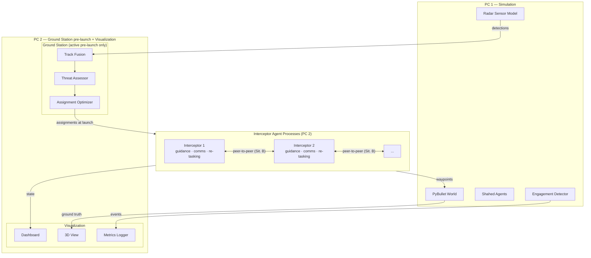
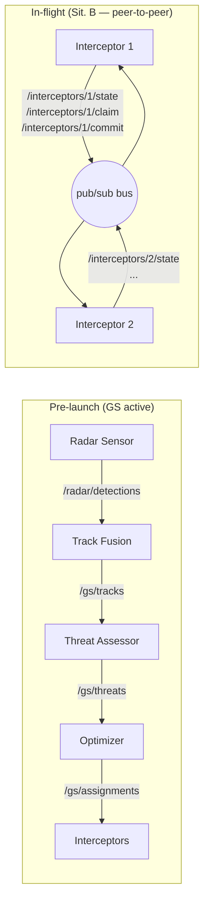
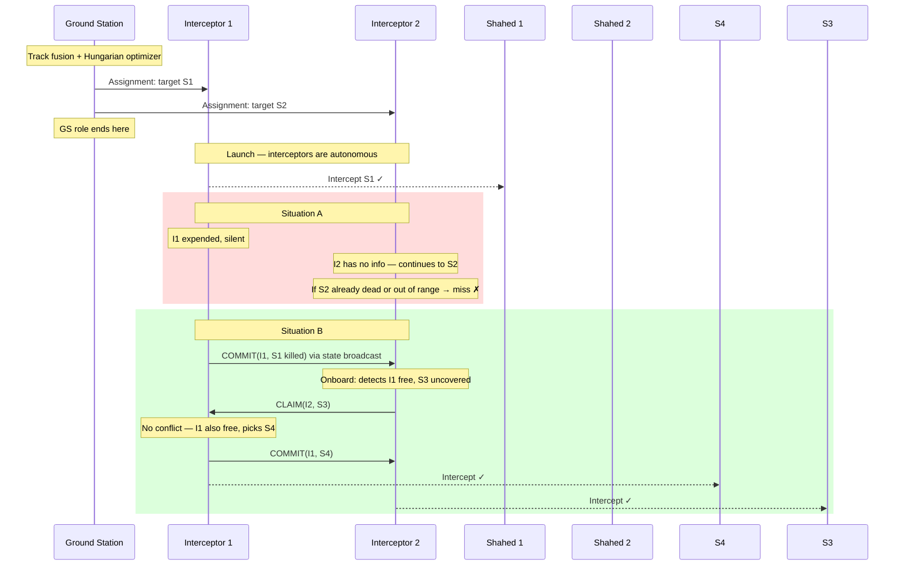
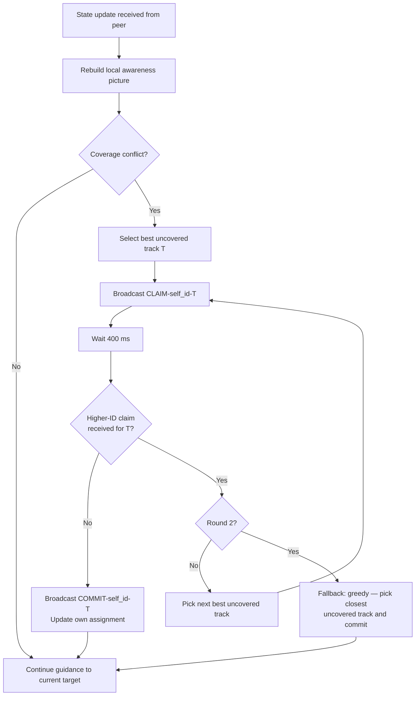

# Architecture Design
## Real-Time Multi-Interceptor Coordination

---

## 1. Component Map

Ground station is active pre-launch only. Post-launch, interceptors are fully autonomous and coordinate peer-to-peer.



---

## 2. Communication Topology



| Topic | Publisher | Subscribers | Phase |
|---|---|---|---|
| `/radar/detections` | Radar Sensor | Track Fusion | Pre-launch |
| `/gs/tracks` | Track Fusion | Threat Assessor, Dashboard | Pre-launch |
| `/gs/threats` | Threat Assessor | Optimizer | Pre-launch |
| `/gs/assignments` | Optimizer | Interceptors | At launch |
| `/interceptors/{id}/state` | Interceptor | All peers, Dashboard | In-flight (Sit. B) |
| `/interceptors/{id}/claim` | Interceptor | All peers | In-flight (Sit. B) |
| `/interceptors/{id}/commit` | Interceptor | All peers | In-flight (Sit. B) |

---

## 3. Situation A vs B — Operational Sequence



---

## 4. Onboard Re-tasking Protocol (Situation B)



**Coverage conflict** is defined as: any active track has 0 interceptors assigned in the local picture, AND at least one interceptor (including self) is assigned to a track with 2+ interceptors, OR to a track that is already dead.

---

## 5. Module Breakdown

### `sim/` — Simulation Engine (PC 1)
```
sim/
├── world.py              # PyBullet init, physics step loop
├── shahed_agent.py       # Shahed: fly toward target at configurable speed
├── interceptor_body.py   # PyBullet body: receives guidance waypoints, applies forces
├── radar_sensor.py       # Gaussian noise model, FOV/range filter
├── engagement.py         # Proximity check → removes both bodies, emits event
└── config_loader.py      # Loads and validates YAML config
```

### `gs/` — Ground Station (PC 2, pre-launch only)
```
gs/
├── track_fusion.py           # Kalman filter bank, one filter per track
├── track_manager.py          # Track birth/death (gating, coasting)
├── threat_assessor.py        # score = w1/distance + w2*speed + w3/ETA
└── assignment_optimizer.py   # scipy.optimize.linear_sum_assignment
```

### `agent/` — Interceptor (PC 2, one process per interceptor)
```
agent/
├── interceptor_agent.py   # Main loop: guidance + comms + re-tasking
├── guidance.py            # Proportional navigation, 100 ms update
├── awareness.py           # Local picture: tracks → {track_id: interceptor_id}
├── retasking.py           # Claim-and-confirm protocol, fallback greedy
└── comms.py               # Pub/sub + packet drop simulation
```

### `viz/` — Visualization (PC 2)
```
viz/
├── pybullet_viz.py   # 3D overlays: assignment lines, radar circles, labels
├── dashboard.py      # Metrics window
└── metrics_logger.py # CSV: per-run stats
```

### `config/`
```
config/
├── scenario_default.yaml
└── schema.py              # Pydantic validation
```

---

## 6. Scenario Config Schema

```yaml
scenario:
  seed: 42
  target_position: [500, 500, 0]
  duration_max: 120                  # seconds
  situation: B                       # A or B

radars:
  - position: [100, 100, 10]
    range: 800
    fov_deg: 360
    noise_std: 5
  - position: [400, 200, 10]
    range: 600
    fov_deg: 360
    noise_std: 8

shaheds:
  count: 4
  speed_mps: [15, 25]
  spawn_radius: 1000
  spawn_angle_spread_deg: 360

interceptors:
  count: 3
  speed_mps: 40
  max_turn_rate_deg_s: 30
  range_m: 700
  launch_position: [480, 480, 0]

comms:
  publish_rate_hz: 5
  packet_loss_prob: 0.10
  consensus_window_ms: 400
  max_claim_rounds: 2
```

---

## 7. Key Algorithms

### Assignment Optimizer (Hungarian, pre-launch)

```
C[i][j] = intercept_time[i][j] / threat_score[j]   if distance[i][j] < range[i]
         = 1e9                                        otherwise

scipy.optimize.linear_sum_assignment(C)  →  O(n³), < 1 ms for n ≤ 10
```

### Proportional Navigation (onboard guidance)

```python
# Every 100 ms
R     = target_pos - self_pos
R_dot = target_vel - self_vel
omega = cross(R, R_dot) / dot(R, R)   # LOS angular rate
a_cmd = N * self_speed * omega         # N ≈ 3–5
```

Robust to track noise and packet loss — works on LOS rate, not exact position.

### Claim-and-Confirm (onboard re-tasking, Situation B)

```python
def retask(self):
    T = self.awareness.best_uncovered_track()
    for round in range(MAX_ROUNDS):
        self.broadcast(Claim(self.id, T))
        competing = self.wait_for_claims(T, timeout=CONSENSUS_WINDOW)
        if not any(c.interceptor_id > self.id for c in competing):
            self.broadcast(Commit(self.id, T))
            self.assignment = T
            return
        T = self.awareness.next_best_uncovered(exclude=[T])
    # fallback
    self.assignment = self.awareness.closest_uncovered()
```

---

## 8. Development Milestones

| # | Deliverable |
|---|---|
| M1 | YAML config + PyBullet world with Shaheds flying toward target |
| M2 | Radar sensor model + Kalman track fusion |
| M3 | Threat assessor + Hungarian optimizer + interceptor launch → **Situation A end-to-end** |
| M4 | PN guidance + engagement detection (verify hit rate) |
| M5 | Peer comms + claim-and-confirm re-tasking → **Situation B end-to-end** |
| M6 | Dashboard + CSV metrics logger (A vs B comparison) |
| M7 | PyBullet 3D overlays + demo polish |
