# Fast Execution Plan — Open-Source Stack
## Real-Time Multi-Interceptor Coordination — EDTH Paris

---

## 1. Rationale

The current architecture (Gazebo + ROS2) is the main speed risk: per-machine system
installs (`apt`), the ros-gz bridge, SDF model authoring. The spec (NFR-7) explicitly
allows **ZeroMQ** instead of ROS2, and for point-mass mobiles (Shaheds + interceptors)
a full physics engine adds nothing that ~50 lines of NumPy kinematics don't provide
(NFR-4 only requires no teleportation and no instant turns).

**Decision: a 100 % pip-installable stack, built only from recognized open-source bricks.**
Everything runs on any laptop with `uv pip install` — no system dependency, no bridge.

The only remaining hand-written code is exactly the hackathon's added value:
PN guidance (~15 lines, already specified), the claim-and-confirm protocol,
the threat score, and packet-loss simulation (`random() < p`).

---

## 2. Stack — each need → one proven brick

| Need | OSS brick | Why |
|---|---|---|
| Pub/sub bus | **pyzmq** (ZeroMQ) | Allowed by NFR-7, zero system install, native PUB/SUB with topic prefixes |
| Serialization | **pydantic v2** (already in `contracts/`) | `model_dump_json()` / `model_validate_json()` — the contracts become the wire format |
| Kalman filter | **filterpy** | The reference library (Labbe's book); constant-velocity `KalmanFilter` in 10 lines |
| Association / gating | **scipy** (`cdist` + `linear_sum_assignment`) | Hungarian already required by FR-5.1; also handles detection↔track association |
| 3D view + dashboard | **Rerun** (`rerun-sdk`) | Replaces both the Gazebo GUI **and** the matplotlib dashboard: 3D, trajectories, assignment lines, time series, **replay** (huge for the demo) |
| Config | **PyYAML + pydantic** | Already in place |
| CLI | **typer** | `python -m run scenario.yaml --situation B` |
| Metrics + A/B report | **pandas + matplotlib** | CSV → comparative bar charts |
| Multi-process launch | **honcho** (Procfile) | One line per node (sim, gs, agent×N, viz), aggregated logs |
| Env + installs | **uv** | Dependency install in seconds |
| Tests | **pytest** | Already in pyproject |

**Optional upgrade:** if multi-target tracking needs to impress, swap filterpy for
**Stone Soup** (UK DSTL's multi-target tracking framework — GNN/JPDA out of the box).
Costs ~2 h of learning curve; filterpy is enough for 4–6 Shaheds.

---

## 3. Step-by-step plan (~10–12 h, 4 teams in parallel)

### Step 0 — Foundation (30 min, unblocks everyone)
- `uv venv && uv pip install -e .` with **pyzmq, filterpy, rerun-sdk, typer, honcho**
  added to `pyproject.toml`.
- Write `contracts/bus.py`: ~60 lines wrapping zmq PUB/SUB —
  `publish(topic, model)`, `subscribe(topics, callback)` — plus a packet-loss
  decorator. Topics in `contracts/topics.py` stay unchanged.

### Step 1 — Kinematic sim + Rerun wired from the start (1–2 h, Team 1)
- 50 Hz NumPy loop: Shaheds fly toward the target; interceptors integrate
  `WaypointCommand` under speed / turn-rate limits (FR-1.2).
- Radar = ground truth + Gaussian noise + range/FOV filter, published at 10 Hz (FR-2).
- Every tick logs to Rerun → you *see* the sim within the first hour.

### Step 2 — Ground station (1–2 h, Team 2, in parallel on `mock_radar`)
- Bank of `filterpy.KalmanFilter` (one per track), gating via
  `scipy.spatial.distance.cdist`, simple birth/coast/death (FR-3).
- Threat score = the formula from the architecture doc (FR-4).
- `linear_sum_assignment` on the cost matrix → `/gs/assignments` (FR-5).

### Step 3 — Interceptor agent, Situation A end-to-end (1–2 h, Team 3, in parallel on `mock_assignments`)
- 10 Hz loop: PN guidance (architecture §7) → `WaypointCommand`;
  state broadcast at 5 Hz (FR-6, FR-7.1).
- **Critical milestone: full Situation A** = first three-team integration.

### Step 4 — Engagement + metrics (1 h)
- Proximity detector in the sim → `/simulation/engagement`, despawn (FR-1.3).
- CSV logger (pandas): neutralized, leakers, convergence failures, wasted munitions (FR-9.3).

### Step 5 — Situation B (2 h, the core of the subject)
- `awareness.py`: track→interceptor dict built from peer broadcasts (FR-7.3).
- Claim-and-confirm exactly as specified in FR-8: 400 ms window, ID priority,
  2 rounds, greedy fallback. Packet loss is already in the bus since Step 0.

### Step 6 — A/B runner + report (1 h)
- typer script: N runs, same seed, Situation A then B; pandas aggregation;
  matplotlib bar charts of the 4 evaluation metrics (spec §8).
- This is *the* deliverable that proves the thesis.

### Step 7 — Demo polish (1–2 h)
- Rerun blueprint: radar circles, colored assignment lines, CLAIM/COMMIT labels
  as timeline events, replay of the moment an interceptor re-assigns itself.
- honcho Procfile launching the whole demo with a single command.

---

## 4. Integration order

```mermaid
gantt
    dateFormat  HH:mm
    axisFormat %H:%M

    section Foundation
    Step 0 bus + deps          :crit, s0, 00:00, 30m

    section Team 1
    Step 1 sim + Rerun         :s1, after s0, 2h
    Step 4 engagement + CSV    :s4, after s1, 1h

    section Team 2
    Step 2 ground station      :s2, after s0, 2h

    section Team 3
    Step 3 agent + PN          :s3, after s0, 2h
    Step 5 Situation B         :s5, after s3, 2h

    section Integration
    Situation A end-to-end     :crit, i1, after s1 s2 s3, 1h
    Step 6 A/B runner          :i2, after i1 s4 s5, 1h
    Step 7 demo polish         :i3, after i2, 2h
```

---

## 5. What changes vs the current architecture doc

| Current (`architecture.md`) | This plan |
|---|---|
| Gazebo world + ros-gz bridge | NumPy kinematic loop (50 Hz) |
| ROS2 topics (`rclpy`) | pyzmq PUB/SUB, same topic names |
| Gazebo GUI + gz markers | Rerun 3D view + blueprint |
| matplotlib dashboard | Rerun time series panels |
| ROS2 launch files | honcho Procfile |
| apt system installs | `uv pip install -e .` only |

Module layout (`sim/`, `gs/`, `agent/`, `viz/`, `contracts/`, `config/`),
topic names, message contracts, algorithms, and all FR/NFR requirements
are **unchanged**.
