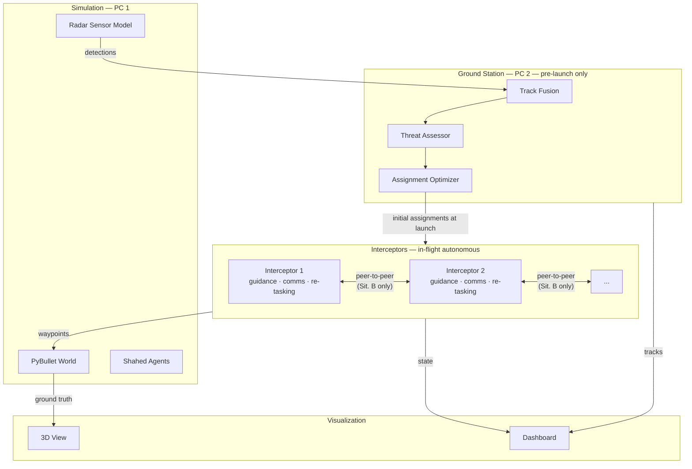

# System Requirements Specification
## Real-Time Multi-Interceptor Coordination — EDTH Paris Hackathon

---

## 1. Purpose & Scope

This system demonstrates that interceptors capable of mid-flight peer-to-peer communication achieve a measurably higher threat-neutralization rate than interceptors flying pre-assigned missions without coordination.

**In scope:** simulation, sensor fusion, threat assessment, assignment optimization, guidance, mid-flight re-tasking, visualization.  
**Out of scope:** decoy discrimination, electronic warfare, terrain occlusion.

---

## 2. Definitions

| Term | Meaning |
|---|---|
| Ground Station (GS) | Central node that fuses sensor data and computes initial assignments; role ends at launch |
| Interceptor | A munition (missile) — single-use, autonomous in flight, carries its own onboard guidance and comms |
| Shahed | An enemy drone flying toward the protected target |
| Track | A fused, filtered estimate of a Shahed's state (position, velocity) |
| Assignment | A (interceptor, track) pair; computed by GS pre-launch, re-computed onboard post-launch |
| Situation A | Baseline: fixed pre-launch assignment, no mid-flight communication |
| Situation B | Proposed: interceptors share state peer-to-peer and re-assign themselves mid-flight |
| Engagement | Interceptor reaches proximity threshold of target → both removed from simulation |
| Convergence failure | Two interceptors converge on the same Shahed while a second Shahed goes uncovered |

---

## 3. System Overview

The ground station's role ends the moment interceptors are launched. After that, interceptors are fully autonomous and (in Situation B) coordinate peer-to-peer without ground station involvement.



---

## 4. Failure Modes Addressed by Communication

Situation B must detect and correct two failure modes that Situation A cannot handle:

**Failure mode 1 — Dead target redundancy:** Interceptor I1 neutralizes Shahed S1. In Situation A, I2 (assigned to S1 as well, or reassigned pre-launch to S1) continues toward the dead target, wasting a shot while another Shahed gets through.

**Failure mode 2 — Convergence on proximate targets:** Two Shaheds fly close together. Due to track noise or PN guidance drift, two interceptors both lock onto the same Shahed S2, leaving S1 uncovered. In Situation A this is undetectable; in Situation B each interceptor's onboard logic sees two agents converging on S2 and one re-assigns to S1.

```mermaid
sequenceDiagram
    participant GS as Ground Station
    participant I1 as Interceptor 1
    participant I2 as Interceptor 2
    participant S1 as Shahed 1
    participant S2 as Shahed 2

    GS->>I1: Assign → S1
    GS->>I2: Assign → S2
    Note over S1,S2: Shaheds flying close together
    Note over GS: GS role ends at launch

    rect rgb(255,220,220)
        Note over I1,I2,S1,S2: Situation A — convergence failure
        Note over I1: Track noise locks I1 onto S2
        I1-->>S2: hits S2 (redundant)
        I2-->>S2: hits S2 (wasted)
        Note over S1: S1 reaches target ✗
    end

    rect rgb(220,255,220)
        Note over I1,I2,S1,S2: Situation B — detected and corrected onboard
        I1->>I2: state broadcast (I am targeting S2)
        I2->>I1: state broadcast (I am targeting S2)
        Note over I1: Onboard: conflict detected — I will re-assign
        I1->>I2: CLAIM(S1)
        Note over I1: No competing claim — commit
        I1-->>S1: Intercept S1 ✓
        I2-->>S2: Intercept S2 ✓
    end
```

---

## 5. Functional Requirements

### FR-1: Simulation Engine
- FR-1.1 Simulate Shaheds flying toward a fixed target with physically realistic trajectories (PyBullet).
- FR-1.2 Simulate interceptors following guidance-computed waypoints with realistic kinematics (speed, turn-rate limits).
- FR-1.3 Engagement detection: when an interceptor reaches within a configurable proximity threshold of its assigned target, both are removed.
- FR-1.4 All scenario parameters are defined in a YAML config file.

### FR-2: Sensor Model
- FR-2.1 Radar positions, range, and field-of-view are set in the YAML config.
- FR-2.2 Each radar adds Gaussian noise to position measurements and respects range/FOV limits.
- FR-2.3 Radar detections are published at a configurable rate (default: 10 Hz).

### FR-3: Track Fusion (Ground Station — pre-launch)
- FR-3.1 The GS fuses detections from all radars into one track per Shahed using a Kalman filter (constant-velocity model).
- FR-3.2 Track fusion updates the unified operational picture at ≥ 5 Hz.

### FR-4: Threat Assessment (Ground Station — pre-launch)
- FR-4.1 Each track is scored by: distance to target, estimated time-to-impact, and speed.
- FR-4.2 Scores drive the priority of the initial assignment.

### FR-5: Assignment Optimizer (Ground Station — pre-launch)
- FR-5.1 The GS computes an optimal assignment using the Hungarian algorithm, minimizing intercept time weighted by threat score.
- FR-5.2 Feasibility is enforced: an interceptor cannot be assigned a target outside its range envelope.
- FR-5.3 The full assignment is issued to interceptors within **2 seconds** of the go signal.
- FR-5.4 Unmatched interceptors hold; uncovered threats are flagged.

### FR-6: Interceptor Guidance (onboard)
- FR-6.1 Each interceptor follows proportional navigation (PN) toward the predicted intercept point of its assigned track.
- FR-6.2 Guidance recomputes every 100 ms using the latest available track data.
- FR-6.3 Configurable maneuverability limits (max turn rate, max speed) are enforced.

### FR-7: Mid-Flight Peer Communication (Situation B — onboard)
- FR-7.1 Each interceptor broadcasts its state (position, velocity, assigned track ID, alive) at 5 Hz to all peers.
- FR-7.2 Packet loss is simulated: each message is dropped with configurable probability (default: 10%).
- FR-7.3 Each interceptor maintains a local awareness picture updated from peer broadcasts.

### FR-8: Onboard Re-tasking (Situation B — onboard)
- FR-8.1 Each interceptor continuously checks its local awareness picture for coverage conflicts: two interceptors on the same track, or a track with no interceptor assigned.
- FR-8.2 When a conflict is detected, the interceptor initiates the **claim-and-confirm** protocol (see FR-8.3–8.5).
- FR-8.3 **Claim phase:** the interceptor broadcasts `CLAIM(self_id, target_track_id)`.
- FR-8.4 **Wait phase:** waits for one consensus window (~400 ms). If a peer with higher ID broadcasts a claim on the same target, this interceptor yields and picks the next best uncovered target.
- FR-8.5 **Commit phase:** if no higher-priority claim is received, broadcasts `COMMIT(self_id, target_track_id)` and updates its assignment. All peers update their local awareness picture accordingly.
- FR-8.6 **Fallback:** if consensus fails after 2 rounds (e.g., due to sustained packet loss), the interceptor falls back to greedy assignment (closest uncovered track).
- FR-8.7 The re-tasking decision (claim to commit) completes within **2 seconds**.

### FR-9: Visualization
- FR-9.1 PyBullet GUI shows in real time: interceptors (blue), Shaheds (red), radar coverage circles, target, engagement events.
- FR-9.2 A dashboard shows: threats remaining, interceptors active, ammo expended, current assignment map, elapsed time.
- FR-9.3 Per-run metrics are written to CSV: scenario config, situation (A/B), threats neutralized, threats that reached target, convergence failures.

---

## 6. Non-Functional Requirements

| ID | Requirement |
|---|---|
| NFR-1 | Initial assignment issued in < 2 s; onboard re-tasking committed in < 2 s |
| NFR-2 | Interceptor guidance loop runs at ≥ 10 Hz |
| NFR-3 | Track fusion end-to-end latency < 200 ms |
| NFR-4 | Trajectories are physics-based — no teleportation, no instant turns |
| NFR-5 | System degrades gracefully at up to 30% packet loss (fallback to greedy) |
| NFR-6 | All scenario parameters configurable via YAML without code changes |
| NFR-7 | Python-only codebase; ROS2 or ZeroMQ for inter-process communication |

---

## 7. Constraints

- Each interceptor is a single-use munition — one engagement, no reload.
- Once launched, an interceptor cannot return.
- Interceptors have a configurable max range; targets outside range cannot be assigned.
- The protected target is a single fixed point.
- No decoy discrimination: all tracked objects are treated as real threats.
- Ground station has no authority over interceptors after launch.

---

## 8. Evaluation Criteria

Same random seed, same YAML config, Situation A vs Situation B:

| Metric | Situation A | Situation B |
|---|---|---|
| Threats neutralized / total | baseline | must be ≥ baseline |
| Convergence failures | expected > 0 | must be lower |
| Munitions wasted on dead/duplicate targets | expected > 0 | must be lower |
| Threats reaching the target | baseline | must be lower |

A statistically meaningful improvement across metrics constitutes a successful demonstration.
