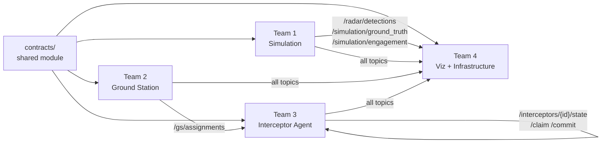

# Workstreams & Contracts
## Real-Time Multi-Interceptor Coordination

---

## Overview

Four teams work in parallel. The **contracts module** (`contracts/`) is the shared foundation — it must be reviewed and agreed on by all four teams before coding starts. Any change to it is a breaking change and requires consensus.

**Dependency rule:** each team mocks its upstream dependencies using the contracts module. No team is blocked waiting for another team's implementation.

---

## Team 1 — Simulation

**Owns:** `sim/`

**Produces:**
- `/radar/detections` — noisy position hits from each radar
- `/simulation/ground_truth` — true positions of all objects (for visualization)
- `/simulation/engagement` — fired when an interceptor kills a Shahed

**Consumes:**
- `/gs/assignments` — to place interceptors at launch position (initial state only)
- `WaypointCommand` — stream of pursuit points from each interceptor agent

**Milestones:**
| # | Deliverable |
|---|---|
| S1 | YAML config loads, Gazebo world launches, Shaheds fly toward target |
| S2 | Radar sensor publishes `/radar/detections` with Gaussian noise + FOV/range filtering |
| S3 | Interceptor body accepts `WaypointCommand`, applies forces within kinematic limits |
| S4 | Engagement detector fires `/simulation/engagement` on proximity threshold |

**Mock for other teams:** publish synthetic `/radar/detections` from a script (`sim/mock_radar.py`) so Team 2 can develop track fusion independently.

---

## Team 2 — Ground Station (pre-launch intelligence)

**Owns:** `gs/`

**Produces:**
- `/gs/tracks` — fused, filtered track list (Kalman output)
- `/gs/threats` — ranked threat list with scores
- `/gs/assignments` — initial (interceptor → track) assignment at launch

**Consumes:**
- `/radar/detections` — from Team 1 (or mock)

**Milestones:**
| # | Deliverable |
|---|---|
| G1 | Kalman filter bank running on `/radar/detections`, publishing `/gs/tracks` |
| G2 | Track manager handles birth/death (gating, coast-then-drop) |
| G3 | Threat scorer running on `/gs/tracks`, publishing `/gs/threats` |
| G4 | Hungarian optimizer running on `/gs/threats`, publishing `/gs/assignments` within 2 s |

**Mock for other teams:** publish synthetic `/gs/assignments` from a script (`gs/mock_assignments.py`) so Team 3 can develop agent logic independently.

---

## Team 3 — Interceptor Agent

**Owns:** `agent/`

**Produces:**
- `/interceptors/{id}/state` — position, velocity, assigned track, alive flag (5 Hz)
- `/interceptors/{id}/claim` — claim message during re-tasking (Sit. B)
- `/interceptors/{id}/commit` — commit message after consensus (Sit. B)
- `WaypointCommand` — pursuit point sent to simulation every 100 ms

**Consumes:**
- `/gs/assignments` — initial assignment at launch
- `/interceptors/{id}/state` from all peers (Sit. B)
- `/interceptors/{id}/claim` and `/commit` from all peers (Sit. B)
- `/gs/tracks` — for PN guidance target position updates

**Milestones:**
| # | Deliverable |
|---|---|
| A1 | Agent receives assignment, publishes own state at 5 Hz |
| A2 | PN guidance loop running at 10 Hz, sending `WaypointCommand` to simulation |
| A3 | Comms layer working with configurable packet loss |
| A4 | Awareness module maintains local picture from peer state broadcasts |
| A5 | Claim-and-confirm re-tasking working (Sit. B), with greedy fallback |

**Mock for other teams:** run a headless agent loop against `gs/mock_assignments.py` and `sim/mock_radar.py`.

---

## Team 4 — Visualization & Infrastructure

**Owns:** `viz/`, `contracts/`, `config/`, comms bus setup

**Produces:**
- `contracts/` module — the shared language for all teams (first deliverable)
- ROS2 launch files and topic namespace setup
- Gazebo 3D overlays (assignment lines, radar circles, labels via gz markers)
- Dashboard (metrics window)
- CSV metrics logger
- `scenario_default.yaml` + Pydantic schema

**Consumes:** all topics (read-only, for display)

**Milestones:**
| # | Deliverable |
|---|---|
| V1 | `contracts/` module merged and reviewed — **this unblocks all other teams** |
| V2 | ROS2 launch file running, all topics discoverable |
| V3 | Dashboard skeleton reading live topics, displaying track count and assignment map |
| V4 | Gazebo 3D overlays: interceptor lines, Shahed markers, radar circles, target marker |
| V5 | CSV metrics logger writing per-run stats |
| V6 | A vs B comparison report generated from CSV |

---

## Contracts — Agreed Message Formats

All message types live in `contracts/messages.py`. **Do not define message formats anywhere else.**

See `contracts/` directory. Key principle: all positions are `(x, y, z)` in meters, all timestamps are `float` seconds since scenario start.

---

## Integration Order

```mermaid
gantt
    dateFormat  HH:mm
    axisFormat %H:%M

    section Team 4
    contracts/ module          :crit, v1, 00:00, 2h
    comms bus setup            :v2, after v1, 2h

    section Team 1
    S1 Shaheds flying          :s1, after v1, 3h
    S2 Radar sensor            :s2, after s1, 2h
    S3 Interceptor body        :s3, after s2, 2h
    S4 Engagement detector     :s4, after s3, 1h

    section Team 2
    G1 Kalman track fusion     :g1, after v1, 3h
    G2 Track manager           :g2, after g1, 2h
    G3 Threat scorer           :g3, after g2, 1h
    G4 Hungarian optimizer     :g4, after g3, 2h

    section Team 3
    A1 Agent + state publish   :a1, after v1, 2h
    A2 PN guidance             :a2, after a1, 3h
    A3 Comms + packet loss     :a3, after a2, 1h
    A4 Awareness module        :a4, after a3, 2h
    A5 Claim-and-confirm       :a5, after a4, 3h

    section Integration
    Sit. A end-to-end          :crit, i1, after s4 g4 a2, 1h
    Sit. B end-to-end          :crit, i2, after i1 a5, 1h
    Demo polish                :i3, after i2 v4 v5, 2h
```

