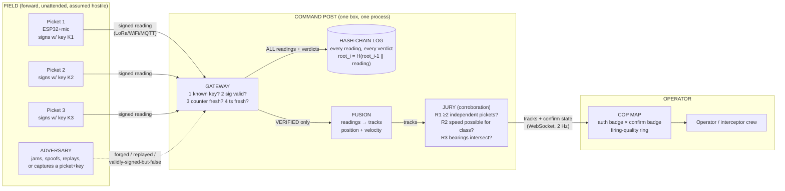
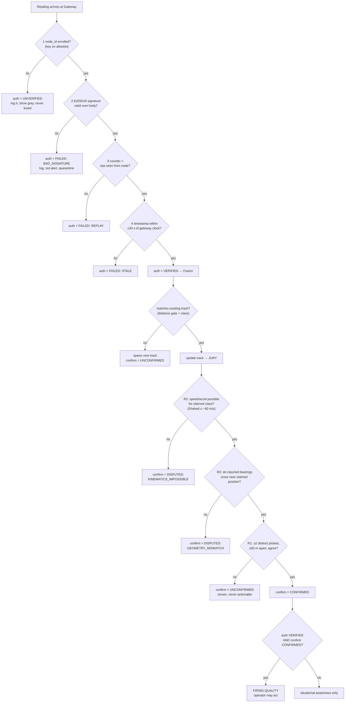

# ARGUS — Simplified Concrete Spec

One sentence: **field sensors sign every detection; the command post verifies who sent it (crypto), then verifies it's true (physical corroboration); only tracks passing both are actionable.**

## 1. The five components

| # | Component | What it is | Where it runs | What it does, concretely |
|---|---|---|---|---|
| 1 | **Picket** (sensor node) | ESP32 + MEMS mic, battery, LoRa/WiFi. €30. | Scattered in the field, 1–3 km apart, along the expected drone approach corridor | Listens. On engine-noise detection: builds a reading `{node_id, counter, timestamp, class, position/bearing, confidence}`, signs it with its private key (Ed25519, key never leaves the node), transmits. Increments counter. That's all it does. |
| 2 | **Gateway** (verifier + log) | One process on a laptop/rugged server | Command post | Receives readings. Runs the 4-step admission check (below). Appends *everything* — pass or fail — to an append-only hash-chain log. Forwards only `VERIFIED` readings to fusion. |
| 3 | **Fusion** (plotter) | Same process as gateway | Command post | Groups readings into tracks: a reading joins an existing track if it's close enough in space/time and class-compatible, else starts a new track. Maintains position + velocity per track (simple weighted average). |
| 4 | **Jury** (corroboration) | Same process | Command post | Decides if each track is *true*, not just authenticated. Applies 3 physical rules (below). Outputs `CONFIRMED` / `UNCONFIRMED` / `DISPUTED`. |
| 5 | **COP** (operator map) | React app in a browser | Command post screen | Dark map. Each track shows two badges: auth (green/grey/red) and confirmation (solid/hollow/amber). Only `VERIFIED + CONFIRMED` tracks get the firing-quality ring an operator may act on. |

Plus a demo-only **Red Team CLI** that plays the adversary from a second laptop.

## 2. Battlefield deployment & data flow



Key deployment fact: **all crypto verification, fusion, and corroboration happen at the command post.** Pickets are dumb, cheap, and expendable — they only sense and sign. Losing one to the enemy loses one key, not the system (that's what the Jury is for).

## 3. What happens to one reading (recipient's evaluation, in order)



Note the order: crypto is a cheap **admission filter** run per-reading; physics is the **truth test** run per-track. A reading that fails crypto never wastes the Jury's time; a reading that passes crypto earns zero truth-credit by itself.

## 4. Who is responsible for what (the "consensus" question)

There is no blockchain consensus and no voting between nodes. Pickets never talk to each other. "Consensus" in ARGUS means exactly one thing: **k-of-n physical corroboration, computed centrally by the Jury.**

| Question | Answered by | Mechanism | Defeats |
|---|---|---|---|
| Who sent this? Was it modified? Is it fresh? | Gateway (crypto) | Ed25519 signature, monotonic counter, timestamp window | Fake nodes, impersonation, tampering, replay |
| Is it TRUE? | Jury (physics) | ≥2 independent pickets agree + kinematics possible + bearings intersect | **Captured node signing perfect lies** — valid key, false world |
| Did history get rewritten later? | Hash-chain log | Every reading chained; root checkpointed every 30 s | Compromised/dishonest gateway editing the past |
| What may the operator shoot at? | COP | Hard rule: ring only on VERIFIED + CONFIRMED | Acting on any single source — including a perfectly authenticated one |

The lifecycle of an attack with a stolen key (the money shot): adversary captures Picket 2, extracts K2, signs a fake "Shahed inbound" → Gateway: enrolled ✓, signature ✓, counter ✓, fresh ✓ → `VERIFIED` (crypto cannot catch this, by design honest about it) → Jury: no other picket hears anything there, no bearing supports it → `DISPUTED: NO CORROBORATION` → amber on map, **no firing ring**, Picket 2 flagged in node-health panel as the lone dissenter. One captured key costs the enemy a burned key, not a wasted interceptor on our side.

## 5. Concrete wire format

```json
{
  "body": {
    "node_id": "picket-07",
    "ctr": 1842,
    "ts": 1749900000123,
    "class": "uas-shahed",
    "conf": 87,
    "lat_u": 48856613, "lon_u": 2352222,
    "bearing": 214
  },
  "sig": "base64(Ed25519(canonical_bytes(body), K_picket07))",
  "kid": "a1b2c3d4"
}
```

Enrollment = picket prints its public key over serial at first boot; operator adds it to the gateway's allowlist with the picket's surveyed position. (Roadmap: secure element, QR enrollment, revocation.)

## 6. Hackathon demo mapping

| Real world | Demo stand-in |
|---|---|
| Field pickets, km apart | 1 real ESP32 + 5 simulated Python nodes (identical wire format, identical keys-and-signing) |
| Shahed overhead | Shahed audio from a speaker next to the real ESP32 |
| LoRa over km | MQTT over a phone hotspot LAN |
| Adversary | `redteam.py` — `inject-ghost` (unknown key), `impersonate` (bad sig), `replay` (old counter), `spoof-authentic` (stolen key, caught by Jury) |
| Interceptor tasking | Firing-quality ring + time-to-asset readout on click |
```
