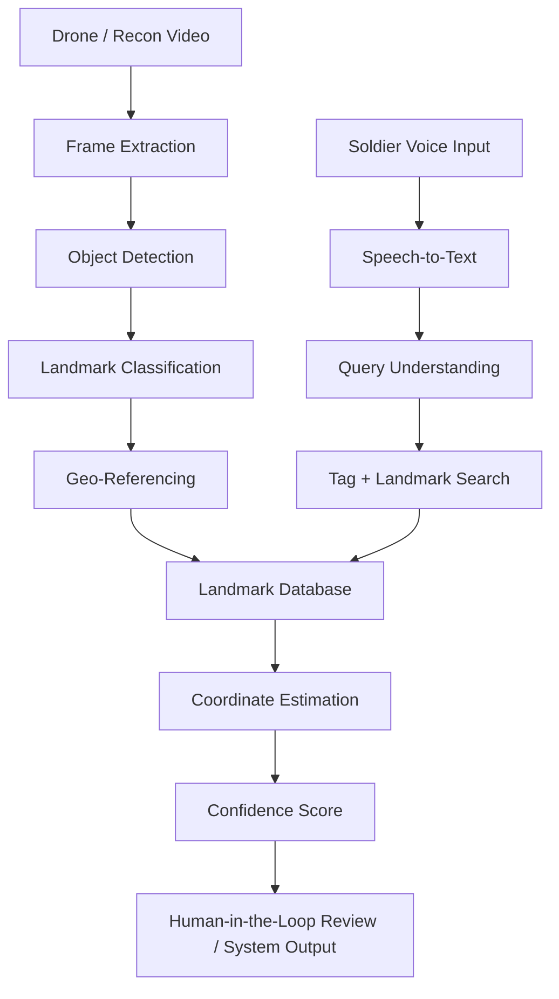
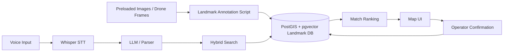

# Map-to-Voice Battlefield Landmark Resolver

## 1. One-Line Summary

A system that converts human battlefield location descriptions like “I am behind the red church” into approximate geospatial coordinates by combining historical drone video, object/landmark detection, geotagged battlefield maps, and voice-to-text query understanding.

---

## 2. Problem

On the battlefield, humans often describe their position using natural language and visible landmarks:

> “I am behind the red church.”  
> “We are near the broken bridge.”  
> “Enemy movement next to the burned-out school.”  
> “The unit is west of the water tower.”

The problem is that these descriptions are useful to humans but hard for software systems to translate into coordinates.

Existing maps may be outdated, incomplete, or not detailed enough. Many battlefield-relevant landmarks are temporary, damaged, partially visible, or locally named by soldiers.

The goal is to bridge the gap between **human landmark language** and **machine-readable geospatial coordinates**.

---

## 3. Core Assumption

The front line does not usually move meter-by-meter every minute.

Therefore, we can assume that over days or weeks there is enough drone, satellite, or reconnaissance footage to build a constantly updated geospatial understanding of the local environment.

Instead of trying to solve everything in real time, the system can process large amounts of video asynchronously and create a battlefield landmark index ahead of time.

---

## 4. Proposed Solution

The system builds a searchable geospatial database of battlefield landmarks.

It processes drone footage, extracts visual landmarks, estimates their coordinates, and attaches human-readable tags to them.

When a soldier says:

> “I am behind the red church”

the system performs:

1. Speech-to-text conversion
2. Natural language parsing
3. Landmark/tag matching
4. Spatial relation interpretation
5. Coordinate estimation
6. Confidence scoring
7. Human review or downstream system handoff

The output is not simply “red church”; it is:

```json
{
  "matched_landmark": "red church",
  "landmark_coordinates": {
    "lat": 48.12345,
    "lon": 37.12345
  },
  "interpreted_position": "behind landmark relative to likely speaker/frontline orientation",
  "estimated_coordinates": {
    "lat": 48.12320,
    "lon": 37.12310
  },
  "confidence": 0.74,
  "alternatives": [
    {
      "landmark": "red brick chapel",
      "confidence": 0.61
    }
  ]
}
```

---

## 5. Key Insight

The difficult part is not only speech recognition.

The real challenge is building a living map of battlefield landmarks that humans naturally refer to.

Humans do not usually say:

> “I am at latitude X and longitude Y.”

They say:

> “I am behind the red church.”

So the system should map the battlefield not only as coordinates, but as a set of **human-understandable objects, landmarks, colors, damage states, and spatial relations**.

---

## 6. System Architecture



---

## 7. Offline / Asynchronous Pipeline

### 7.1 Input Data

Possible inputs:

- Drone video
- FPV drone footage
- Fixed-wing reconnaissance footage
- Satellite imagery
- Existing military maps
- OpenStreetMap data
- Manual annotations from soldiers or analysts
- Previous mission reports
- Geotagged photos

### 7.2 Frame Extraction

The system extracts representative frames from video.

Possible strategies:

- Extract one frame every N seconds
- Extract frames when camera angle changes
- Extract high-quality frames only
- Remove blurry or duplicate frames
- Prioritize frames with stable GPS/IMU metadata

### 7.3 Object and Landmark Detection

The system detects objects that are likely useful as human references.

Examples:

- Churches
- Towers
- Bridges
- Roads
- Crossroads
- Rivers
- Tree lines
- Buildings
- Schools
- Factories
- Warehouses
- Farm structures
- Trenches
- Destroyed vehicles
- Burned buildings
- Antennas
- Power lines
- Water towers
- Railways

### 7.4 Visual Attribute Extraction

Each object should receive human-descriptive tags.

Examples:

- Color: red, white, grey, green roof
- Shape: tall, round, rectangular, narrow
- Condition: damaged, burned, collapsed, intact
- Material: brick, concrete, metal, wood
- Relative location: near bridge, next to road, beside river
- Visibility: visible from north, visible from road, partially hidden
- Uniqueness: only red-roofed church in the area

Example object record:

```json
{
  "id": "landmark_00192",
  "type": "church",
  "tags": ["red roof", "brick", "damaged", "tall tower", "near crossroads"],
  "coordinates": {
    "lat": 48.12345,
    "lon": 37.12345
  },
  "confidence": 0.89,
  "last_seen": "2026-06-12T09:20:00Z",
  "sources": ["drone_video_2026_06_12_sector_4"]
}
```

### 7.5 Geo-Referencing

The detected landmark must be placed on a map.

Possible methods:

- Use drone GPS metadata
- Use camera pose estimation
- Match video frames to satellite imagery
- Use visual SLAM / photogrammetry
- Use known map anchors
- Use manually verified coordinates
- Use triangulation from multiple drone passes

### 7.6 Landmark Database

The final output of the offline pipeline is a geospatial landmark database.

It should support:

- Keyword search
- Semantic search
- Geospatial search
- Time freshness filtering
- Confidence scoring
- Multiple aliases per landmark
- Human review status
- Source traceability

---

## 8. Real-Time Query Pipeline

### 8.1 Voice Input

A soldier speaks naturally:

> “I am behind the red church.”

The system converts this to text.

### 8.2 Natural Language Parsing

The system extracts:

- Main landmark: `church`
- Attributes: `red`
- Spatial relation: `behind`
- Optional context: sector, unit, road, village, direction, previous position
- Uncertainty: maybe, around, close to, approximately

### 8.3 Landmark Matching

The system searches the landmark database for candidates.

Example query:

```json
{
  "object_type": "church",
  "attributes": ["red"],
  "area_context": "current sector",
  "max_distance_from_unit": "5km"
}
```

Possible matches:

| Candidate | Description | Distance | Confidence |
|---|---:|---:|---:|
| Landmark A | Red-roofed church near crossroads | 1.2 km | 0.86 |
| Landmark B | Red brick chapel near tree line | 2.4 km | 0.64 |
| Landmark C | Damaged church with brown roof | 3.1 km | 0.42 |

### 8.4 Spatial Relation Interpretation

“Behind” is ambiguous.

It may depend on:

- Speaker orientation
- Enemy/frontline direction
- Road direction
- Camera perspective
- Previously known unit movement
- Local convention

The system should not pretend certainty where there is none.

Instead, it should output an estimated zone and confidence.

Example:

```json
{
  "landmark": "red church",
  "relation": "behind",
  "interpretation": "behind relative to current friendly approach direction",
  "estimated_area": "polygon",
  "confidence": 0.68
}
```

### 8.5 Output

The system returns:

- Best matching landmark
- Landmark coordinates
- Estimated soldier position
- Confidence score
- Alternative interpretations
- Source evidence
- Recommended human review when confidence is low

---

## 9. MVP Scope for Hackathon

### MVP Goal

Demonstrate that a natural-language battlefield landmark description can be matched to a coordinate using a prebuilt landmark database.

### MVP Inputs

- A small set of drone images or map screenshots
- Manually or semi-automatically annotated landmarks
- A voice or text query
- A simple map interface

### MVP Features

1. Upload or preload battlefield imagery
2. Detect or manually annotate landmarks
3. Assign tags to landmarks
4. Convert voice to text
5. Parse the query
6. Match query to landmark
7. Show matched location on a map
8. Display confidence and alternatives

### MVP Example

Input:

> “I am behind the red church.”

System output:

- Matched: `Red church near main road`
- Coordinates: `48.12345, 37.12345`
- Estimated position: area behind landmark
- Confidence: `74%`
- Alternative: `red-roofed chapel 600m east`

---

## 10. Possible Tech Stack

### Computer Vision

- YOLO / RT-DETR for object detection
- CLIP / SigLIP for visual-language matching
- Segment Anything for object masks
- OCR for signs, road names, building labels
- Image embedding model for semantic search

### Geospatial

- PostGIS
- QGIS
- OpenStreetMap
- Mapbox / Leaflet
- GeoJSON
- GDAL
- Rasterio

### Search / Matching

- PostgreSQL + pgvector
- ElasticSearch / OpenSearch
- FAISS
- Hybrid keyword + embedding search

### Voice and Language

- Whisper / faster-whisper for speech-to-text
- Small local LLM for query parsing
- Rules-based fallback parser for reliability
- Multilingual support for Ukrainian, English, Polish, Russian, etc.

### Backend

- Python / FastAPI
- Node.js / TypeScript
- Postgres + PostGIS
- Object storage for frames and metadata

### Frontend

- React
- Leaflet / Mapbox GL
- Simple operator dashboard
- Map with landmark pins and confidence zones

---

## 11. Data Model

### Landmark

```json
{
  "id": "string",
  "type": "church | bridge | tower | road | building | vehicle | other",
  "name": "optional human-readable name",
  "tags": ["red roof", "damaged", "near road"],
  "aliases": ["red church", "brick church", "church near main road"],
  "coordinates": {
    "lat": "number",
    "lon": "number"
  },
  "geometry": "point | polygon",
  "confidence": "number",
  "last_seen": "timestamp",
  "source_ids": ["string"],
  "review_status": "unreviewed | reviewed | verified"
}
```

### Query

```json
{
  "raw_audio": "file",
  "transcript": "I am behind the red church",
  "parsed_landmark_type": "church",
  "parsed_attributes": ["red"],
  "parsed_spatial_relation": "behind",
  "context": {
    "unit_id": "optional",
    "sector": "optional",
    "last_known_position": "optional"
  }
}
```

### Match Result

```json
{
  "query_id": "string",
  "matched_landmark_id": "string",
  "landmark_confidence": "number",
  "relation_confidence": "number",
  "estimated_position": "point | polygon",
  "alternatives": ["landmark_id"],
  "requires_human_review": true
}
```

---

## 12. Confidence and Safety Logic

The system should never output a single coordinate without confidence context.

It should return:

- Best match
- Confidence score
- Alternative matches
- Estimated uncertainty radius or polygon
- Source imagery
- Timestamp of last observation
- Human review requirement when confidence is low

Example thresholds:

| Confidence | System Behavior |
|---:|---|
| > 0.85 | High-confidence match, show coordinate and evidence |
| 0.60–0.85 | Medium-confidence match, show alternatives |
| < 0.60 | Low-confidence, require human confirmation |

---

## 13. Important Limitations

### Ambiguous Human Language

“Behind”, “near”, “left of”, and “after” are context-dependent.

### Changing Battlefield

Buildings may be destroyed, roads blocked, bridges damaged, and landmarks altered.

### Sensor Quality

Drone footage may be blurry, obstructed, jammed, or outdated.

### GPS and Metadata Issues

Drone GPS may be inaccurate or unavailable.

### Multiple Similar Landmarks

There may be several churches, bridges, or red-roofed buildings in one sector.

### Adversarial Deception

The enemy may use decoys, camouflage, fake landmarks, or deliberately misleading descriptions.

### Multilingual Variants

The same landmark may be described differently by soldiers speaking different languages or dialects.

---

## 14. Human-in-the-Loop Design

Because mistakes can be dangerous, the system should assist human operators rather than silently making final decisions.

Human operators should be able to:

- Confirm or reject landmark matches
- Add aliases
- Correct coordinates
- Mark landmarks as outdated
- Verify new drone-derived observations
- Flag ambiguous descriptions
- Review low-confidence outputs

---

## 15. Demo Flow

### Step 1: Preload Map Area

Show a map of a small battlefield sector.

### Step 2: Add Landmark Data

Display detected landmarks:

- Red church
- Broken bridge
- Water tower
- Burned warehouse
- Tree line
- Damaged school

### Step 3: User Speaks

User says:

> “I am behind the red church.”

### Step 4: Speech-to-Text

System displays:

> “I am behind the red church.”

### Step 5: Query Parsing

System extracts:

```json
{
  "landmark": "church",
  "attribute": "red",
  "relation": "behind"
}
```

### Step 6: Match

System highlights the red church on the map.

### Step 7: Coordinate Estimate

System shows:

- Landmark coordinate
- Estimated area behind the landmark
- Confidence score
- Alternative landmarks

### Step 8: Operator Review

Operator confirms:

> “Correct landmark.”

System stores this as feedback.

---

## 16. Evaluation Metrics

Possible metrics:

- Landmark detection accuracy
- Landmark geolocation error
- Tagging accuracy
- Query parsing accuracy
- Correct landmark match rate
- Average coordinate error
- False positive rate
- Human review rate
- Time from voice input to candidate coordinate
- Robustness under noisy audio
- Robustness under outdated imagery

---

## 17. Hackathon Deliverables

### Required

- Working prototype
- Demo map
- Small landmark database
- Voice/text input
- Query parser
- Landmark matcher
- Coordinate output
- Confidence score

### Nice to Have

- Drone image processing
- Automatic object detection
- CLIP-based visual search
- Multilingual queries
- Operator feedback loop
- GeoJSON export
- Offline/local mode
- Mobile-friendly interface

---

## 18. Suggested Prototype Architecture



---

## 19. Example Pitch

Soldiers naturally describe locations using landmarks, not coordinates.  
Our system turns descriptions like “behind the red church” into approximate coordinates by pre-processing drone footage into a searchable battlefield landmark database.  
It combines computer vision, geospatial mapping, speech-to-text, and semantic search to create a practical human-to-map interface for fast situational awareness.

---

## 20. Why This Matters

In high-stress environments, asking people to provide exact coordinates is slow and error-prone.

Human language is fast, but computers need structured data.

This system makes battlefield communication more usable by translating natural human descriptions into map-aware, coordinate-aware outputs while keeping uncertainty and human review visible.

---

## 21. Responsible Use Constraints

This concept should be framed as a decision-support and situational-awareness system.

It should avoid automatic irreversible actions.

Recommended constraints:

- Always show confidence and uncertainty
- Require human confirmation for low-confidence matches
- Keep source evidence visible
- Log all outputs
- Mark stale data clearly
- Prefer area estimates over false precision
- Avoid fully autonomous downstream action based only on voice input

---

## 22. Future Extensions

- Continuous drone ingestion
- Automatic landmark change detection
- Offline edge deployment
- Soldier-specific landmark aliases
- Multilingual military phrase support
- Integration with existing command-and-control maps
- Heatmap of landmark reliability
- Automatic stale-landmark detection
- Frontline-aware interpretation of “behind”, “left”, and “right”
- AR overlay for field operators

---

## 23. Final TL;DR

Build a constantly updated geospatial memory of the battlefield from drone footage.

Tag every useful landmark with human-readable descriptions.

When someone says “I am behind the red church,” convert that phrase into a landmark search, infer the spatial relation, and return approximate coordinates with uncertainty and human-review support.
